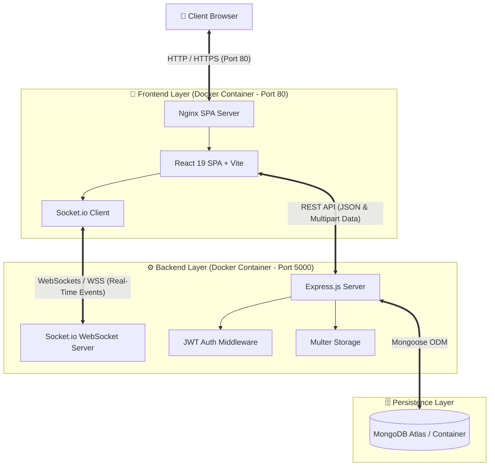
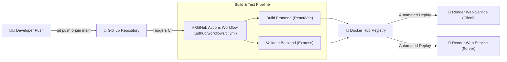

# 💬 QuickChat - Real-Time Chat Application

[](https://react.dev/)
[](https://nodejs.org/)
[](https://expressjs.com/)
[](https://www.mongodb.com/)
[](https://socket.io/)
[](https://hub.docker.com/)
[](https://render.com/)
[](LICENSE)

A full-stack, enterprise-grade real-time messaging platform engineered with **React 19**, **Node.js/Express**, **Socket.io WebSockets**, **MongoDB**, and **Docker**.

---

## 🌐 Live Deployment & Production URLs

| Component | Service Platform | Live Access URL | Docker Hub Repository |
| :--- | :--- | :--- | :--- |
| 🎨 **Frontend Client** | Render (Nginx SPA) | [https://chat-client-latest.onrender.com](https://chat-client-latest.onrender.com) | `poojadev3/chat_client:latest` |
| ⚙️ **Backend API** | Render (Node.js/Express) | [https://chat-server-latest-0axs.onrender.com](https://chat-server-latest-0axs.onrender.com) | `poojadev3/chat_server:latest` |
| 🗄️ **Database** | MongoDB Atlas / Cloud | `mongodb+srv://...` | N/A |

---

## 🏗️ System Architecture



---

## 🔄 CI/CD & Deployment Pipeline



---

## ✨ Key Features

- 🔐 **Authentication & Security**: Secure JWT authentication with bcrypt password hashing and stateful token validation.
- 💬 **Real-time Messaging**: Instant bi-directional messaging with zero polling using **Socket.io**.
- 🖼️ **Media Attachments**: Support for image and document uploads via **Multer**.
- 🟢 **Live Online/Offline Status**: Dynamic real-time user status tracking across active socket connections.
- 📬 **Read Receipts & Unread Counters**: Track message seen status (`seenAt`) and live unread badges.
- 🎨 **Modern Responsive UI**: Built with React 19, Tailwind CSS v4, dynamic glassmorphism UI, and custom animations.
- 🔀 **Nginx SPA Routing**: Custom Nginx rewrite configuration (`try_files $uri $uri/ /index.html`) preventing 404s on browser reloads.

---

## 📸 Application Showcase

| Login & Authentication | Real-Time Chat Dashboard | User Profile Management |
| :---: | :---: | :---: |
|  |  |  |

---

## 🛠️ Technology Stack

| Category | Technologies Used |
| :--- | :--- |
| **Frontend** | React 19, Vite 7, Tailwind CSS v4, React Router v7, Socket.io Client |
| **Backend** | Node.js 20, Express.js 5, Socket.io 4, Mongoose ODM, JWT, BcryptJS, Multer |
| **Database** | MongoDB 7 / MongoDB Atlas |
| **Containerization** | Docker, Docker Compose, Nginx Alpine, Multi-stage Builds |
| **DevOps & CI/CD** | GitHub Actions, Docker Hub, Render Cloud Platform |

---

## 📁 Project Structure

```text
Chat-app/
├── client/                     # Frontend React SPA application
│   ├── public/                 # Static assets
│   ├── src/                    # React components, pages, contexts, & services
│   │   ├── components/         # UI components (ChatBox, UserList, ConnectionStatus)
│   │   ├── contexts/           # React Context (AuthContext)
│   │   ├── pages/              # Router pages (Login, Register, Chat, Profile)
│   │   └── services/           # API (api.js) & WebSocket (socket.js) services
│   ├── .env.production         # Production environment endpoints
│   ├── nginx.conf              # Nginx SPA fallback configuration
│   └── vite.config.js          # Vite build config
│
├── server/                     # Backend Node.js/Express server
│   ├── middleware/             # Authentication & file upload middleware
│   ├── models/                 # Mongoose schemas (User, Message)
│   ├── routes/                 # Express API routes (auth, users, messages)
│   └── index.js                # Server entry point & Socket.io handler
│
├── docker/                     # Docker build specifications
│   ├── Dockerfile.client       # Multi-stage Nginx client Dockerfile
│   └── Dockerfile.server       # Lightweight Node.js server Dockerfile
│
├── .github/workflows/          # GitHub Actions CI workflow (ci.yml)
├── docker-compose.yml          # Multi-container local orchestration
└── README.md                   # Project documentation
```

---

## ⚙️ Getting Started & Local Setup

### Prerequisites
- [Node.js](https://nodejs.org/) (v18 or higher)
- [Docker Desktop](https://www.docker.com/products/docker-desktop/) (for containerized setup)
- [MongoDB](https://www.mongodb.com/) (running locally or MongoDB Atlas URI)

---

### Option A: Local Run with Docker Compose (Recommended)

Run the entire application stack (MongoDB, Backend Server, Nginx Client) with one command:

```bash
# 1. Clone repository
git clone https://github.com/pooja-dev3/Chat-app.git
cd Chat-app

# 2. Build and launch containers
docker-compose up --build
```

- **Frontend Client**: `http://localhost:5173`
- **Backend API**: `http://localhost:5000`
- **MongoDB**: `mongodb://localhost:27017/chatapp`

---

### Option B: Manual Setup

#### 1. Backend Setup (`/server`)
```bash
cd server
npm install
```
Create a `.env` file inside `/server`:
```env
PORT=5000
MONGODB_URI=mongodb://localhost:27017/chatapp
JWT_SECRET=your_super_secret_jwt_key
JWT_EXPIRES_IN=7d
NODE_ENV=development
```
Start server:
```bash
npm run dev
```

#### 2. Frontend Setup (`/client`)
```bash
cd client
npm install
npm run dev
```

---

## 🐳 Docker Setup & Hub Deployment Commands

### Build Images Locally
```bash
# Build Backend Server Image
docker build -t poojadev3/chat_server:latest -f docker/Dockerfile.server .

# Build Frontend Client Image
docker build -t poojadev3/chat_client:latest -f docker/Dockerfile.client .
```

### Push Images to Docker Hub
```bash
docker push poojadev3/chat_server:latest
docker push poojadev3/chat_client:latest
```

---

## 📡 REST API Reference

| Method | Endpoint | Access | Description |
| :--- | :--- | :---: | :--- |
| `POST` | `/api/auth/register` | Public | Register a new user account |
| `POST` | `/api/auth/login` | Public | Authenticate user & receive JWT token |
| `GET` | `/api/auth/me` | Private | Fetch authenticated user profile |
| `POST` | `/api/auth/logout` | Private | Log out user & update status |
| `PUT` | `/api/auth/profile` | Private | Update user profile details & avatar |
| `GET` | `/api/users/all` | Private | Fetch list of registered users |
| `GET` | `/api/users/search?q=name` | Private | Search users by name or email |
| `GET` | `/api/messages/:userId` | Private | Retrieve chat message history |
| `POST` | `/api/messages/send` | Private | Send text message or upload media |
| `PUT` | `/api/messages/:id/seen` | Private | Mark message as seen |

---

## 🌿 Git Branching Strategy

We follow a 3-tier branching deployment model:

```text
feature/*  ───(Merge)───>  develop (Development Build)  ───(Merge)───>  main (Production Release)
```

- **`feature/*`**: Isolated feature development branches.
- **`develop`**: Integration branch for staging builds.
- **`main`**: Production branch triggering production CI/CD deployments.

---

## 📜 License

This project is licensed under the **ISC License**.